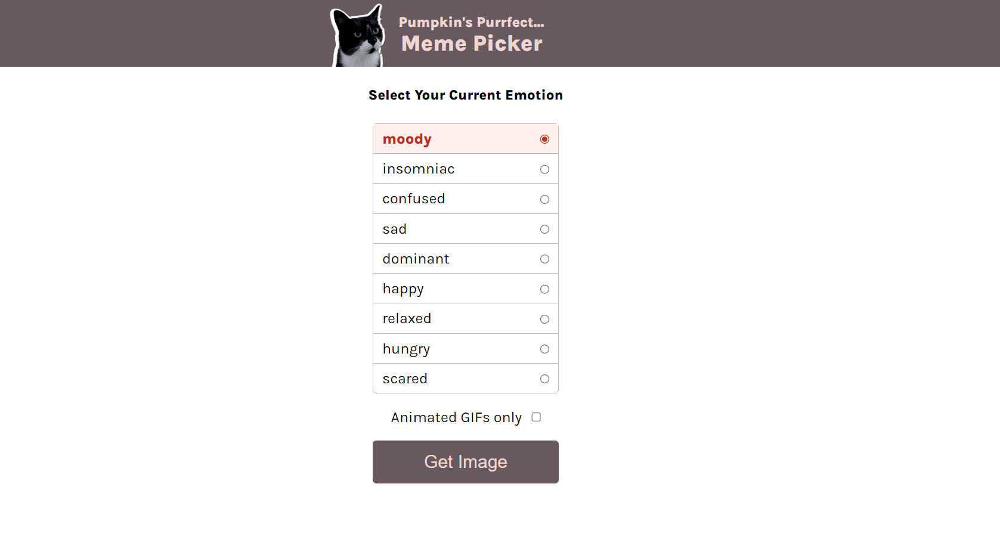
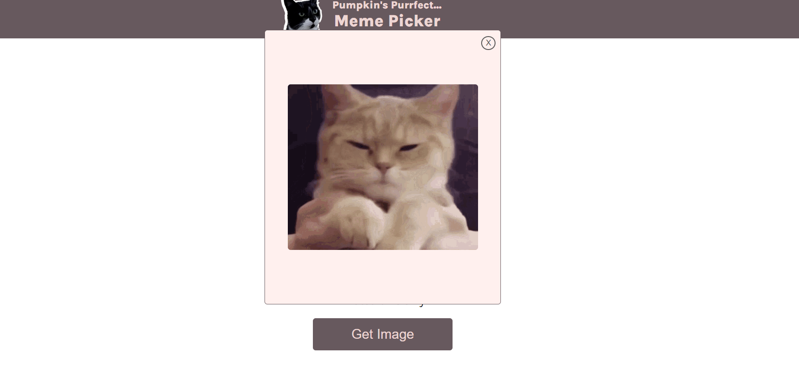

## Table of contents

- [Overview](#overview)
  - [The challenge](#the-challenge)
  - [Screenshot](#screenshot)
  - [Links](#links)
  - [How to install](#how-to-install)
- [My process](#my-process)
  - [What I learned](#What-I-learned)

## Overview

### The challenge

Build Meme picker using HTML, CSS and JS

### Screenshot

### Links

- Solution URL: [GitHub](https://github.com/memo-ibrahim-alean/Meme-Picker)
- Live Site URL: [Live](https://memo-ibrahim-alean.github.io/Meme-Picker/)

### How to install

- Clone Repo or Download Zip
- That's it! 🎉

## My process

### What I learned

- for of
- import/export
- radio & checkbox inputs
- querySelector
- getElementsByClassName
- ClassList.remove
- .includes()
- .filter()
